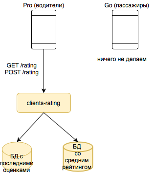
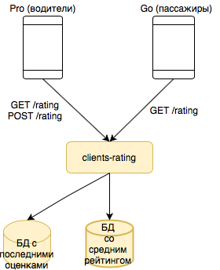
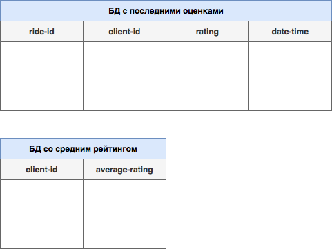

# Рейтинг пассажира.

## 1) Постановка задачи. Гипотеза.

### Постановка задачи: 
Нужно продумать логику выставления оценки водителем после завершения поездки, описать, где и в каком формате должен хранится рейтинг. Подумать над честной формулой вычисления общей оценки. Понять, какие нужны эндпоинты (ручки) для клиентского приложения и водительского. И другие особенности, все, что посчитаете важным.

### Гипотеза:
После реализации фичи повысится безопасность водителя, его автомобиля, и поездки в целом. Возможно данная фича повлияет и на сознательность самих пассажиров (будут реже опаздывать к такси, реже хамить водителю и т.п., так как пассажир рискует рейтингом).

## 2) MVP и полноценный вариант + архитектура.

### MVP: 
Создадим микросервис clients-rating, в котором будет два эндпоинта - GET запрос и POST запрос. POST запрос для выставления оценки пассажиру, GET запрос для просмотра среднего рейтинга пассажира. В качестве формулы можно взять простое средее арифметическое или же, как предлагают в https://taxi.yandex.ru/action/rating_ru, средневзвешенное из последних N оценок, где недавние оценки имеют больше веса, чем старые.  
У данного сервиса будет две базы данных: одна для хранения последних N оценок, вторая для хранения среднего рейтинга клиента, чтобы каждый раз его не пересчитывать. Также в первой БД будет сохранен id поезкди, если вдруг понадобится получить детальную информацию о ней из других сервисов.  
Для клиентского приложения ничего дорабатывать не нужно.



### Полноценный вариант: 
Полноценный вариант почти ничем не будет отличаться от MVP, разве что нужно дописать клиентскую версию приложения. Можно со временем также добавить некоторые интересные фичи, например, позволять при желании водителю оставлять письменный отзыв о клиенте, а при GET запросе выдавать историю отзывов о пассажире.



### Архитектура DB:



## 3) API взаимосвязей между компонентами.

```yaml
openapi: 3.0.0
info:
  description: Рейтинг пассажира.
  version: "1.0.0"
  title: clients-rating

paths:
  /rating/clients:
    get:
      operationId: getClientRating
      description: Получить рейтинг пассажира.
      parameters:
        - in: query
          name: client_id
          description: Идентификатор пассажира.
          required: true
          schema:
            type: integer
            format: int64
            minimum: 1
      responses:
        '200':
          $ref: '#/components/responses/ClientRatingResponse'
        '400':
          $ref: '#/components/responses/BadRequestResponse'
        '404':
          $ref: '#/components/responses/NotFoundResponse'

    post:
      operationId: postClientRating
      description: Поставить оценку пассажиру.
      requestBody:
        required: true
        content:
          application/json:
            schema: 
              type: object
              required:
                - ride_id
                - client_id
                - rating
              properties:
                client_id:
                  type: integer
                  format: int64
                  minimum: 1    
                ride_id:
                  type: integer
                  format: int64
                  minimum: 1  
                rating:
                  type: integer
                  format: int32
                  minimum: 1
                  maximum: 5
      responses:
        '200':
          description: Оценка поставлена.
        '400':
          $ref: '#/components/responses/BadRequestResponse'

components:
  responses:
    ClientRatingResponse:
      description: OK
      content:
        application/json:
          schema: 
            type: object
            required:
              - average_rating
            properties:
              average_rating:
                type: number
                format: double
                minimum: 1.0
                maximum: 5.0
    BadRequestResponse:
      description: Bad Request
      content:
        application/json:
          schema: 
            type: object
            properties:
              message:
                type: string   
    NotFoundResponse:
      description: Not Found
      content:
        application/json:
          schema: 
            type: object
            properties:
              message:
                type: string           
```

## 4) Тесты.

Юнит тесты для каждой ручки. (Проверка на невалидные данные, проверка на корректность работы GET и POST запроса, проверка на GET запрос клиента без рейтинга) 
Интеграционные тесты для проверки взаимодействия запросов друг с другом в пределах данного микросервиса. (Проверка на то, что GET и POST запрос нормально взаимодействуют между собой, то есть что средний рейтинг верно обновляется и отображается) 
Нагрузочные тесты писать я пока не вижу смысла, ибо функционал не является критичным или очень важным.

## 5) Эксперимент. Метрики.

Для эксперимента, который бы проверял наши гипотезы, выберем три контрольные группы: людей, у которых низкий рейтинг и людей, у которых высокий рейтинг и людей со средним рейтингом. Для первой группы ожидается повышение числа отказов со стороны водителей, относительно третьей группы, а для второй группы ожидается понижение отказов со стороны водителей, относительно третьей группы. То есть основной метрикой будет число отказов со стороны водителей. Если наши ожидания оправдались, то гипотезы верны. Можно также оценить по похожей схеме частоту отказов относительно частоты отказов без клиентского рейтинга.

