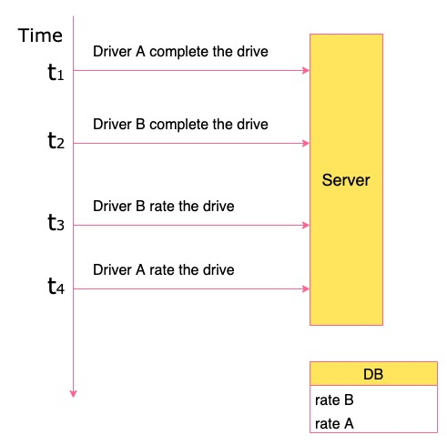
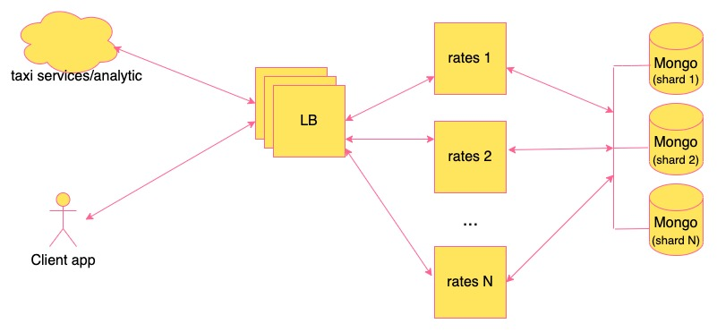

## Рейтинг пассажиров

Водитель оценивает пассажира. Пассажир и водитель имеют возможность увидеть свой текущий рейтинг.

Введя рейтинг для пассажиром мы, возможно, сможем улучшить качество такси (для водителей и пассажиров). 
Пассажиры, стараясь улучшить свой рейтинг, будут:
- более пунктуальны
- ставить более удобные точки 
- и т.д.
  
Также, это поможет нам анализировать какие критерии не нравятся водителям для дальшейшего улучшения сервиса.

### Формула рейтинга

Возьмем средневзвешенное из последних 40 оценок. 
Недавние оценки имеют больше веса, чем старые.

Будем брать последние 40 оценок, сортировать их по свежести и нумеровать от 1 до 40.
Полученные номера будут весами.

`xi` - оценка водителя  
`wi` - вес (чем свежее оценка, тем выше вес)

### MVP

Сделаем MVP на Python и Postgres, развернутый на одной машине.
Ограничим использование сервиса, случайно набранной контрольной группой людей, через фича-тоглы на бэкенде существующей системы.

При получении нового рейтинга от водителя будем:
- брать последние 40 оценок (захардкодим этот параметр в коде)
- динамически генерировать веса (через оконную ф-ю `row_number`)
- пересчитывать рейтинг на стороне приложения и сохранять в базу

Т.к водитель может отправлять рейтинг после завершения поездки, может быть ситуация когда за старую поездку рейтинг ставится позже, чем за более свежую:    

Для разрешения этой ситуации будем сортировать по полю `completed_at` (время выполнения заказа), которое нам будет отправлять клиентское приложение.

Сделаем 2 ручки:
- идемпотентное добавление рейтинга водителем
- получение рейтинга пассажира  

[openapi](assets/openapi.yaml)
  
Схема базы:  

### Полноценный сервис
Для того, чтобы подготовить наш сервис к нагрузке:
- добавим балансировщики (LB), сконфигурированные через DNS.
- размажем нагрузку на несколько инстансов (контейнеров).  

Для выбора кол-ва LB/инстансов проведем нагрузочное тестирование.

Захардкоженную констану `40` (лимит кол-ва последних оценок при вычислении рейтинга)
вынесем в адмику основной системы. Добавим обращение в админку при старте сервиса и добавим ручку для подцепления конфига из админки.

В качесве базы перейдем на MongoDB, т.к у нас:
- результаты построения MVP показывают, что нет необходимости в реляционной БД, т.к таблицы получились независимыми (self-contained).
- проще масштабируется

Интерфейс взаимодействия с внешним миром остается таким же как и в MVP варианте (за исключением интеграции админки).
В Mongo настроим шардирование.

### Бизнеc метрики
- Сколько водителей делают оценки?
- Корреляция принятия пассажира с хорошим/плохим рейтингом водителем
